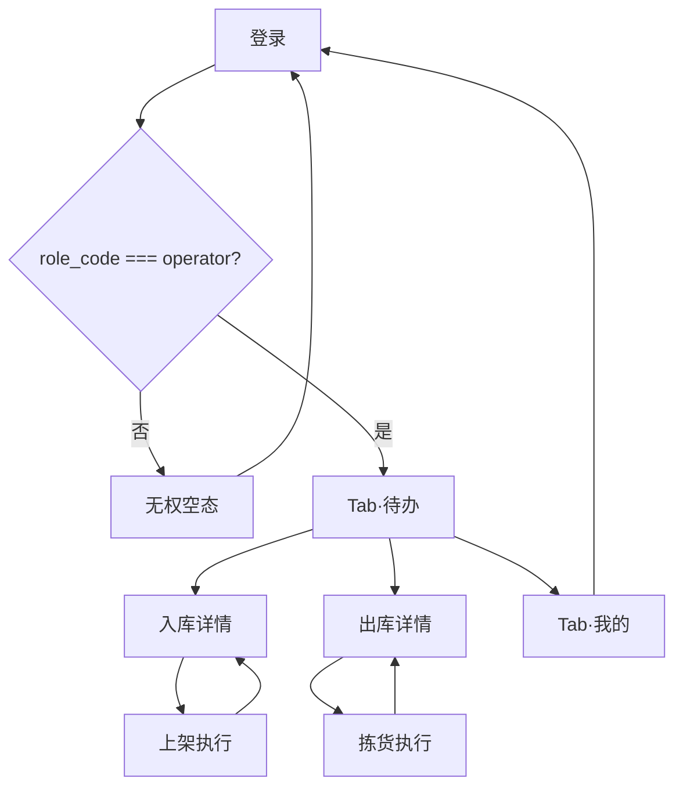

# 页面与数据流

## 路由总览

| 路径 | 类型 | 标题 | Design Override |
|---|---|---|---|
| `pages/login/login` | 独立 | 登录 | [login.md](../../design-system/wms/pages/login.md) |
| `pages/todo/index` | Tab | 待办 | [todo.md](../../design-system/wms/pages/todo.md) |
| `pages/my/index` | Tab | 我的 | [my.md](../../design-system/wms/pages/my.md) |
| `pages/inbound/detail` | Stack | 入库详情 | [order-detail.md](../../design-system/wms/pages/order-detail.md) |
| `pages/inbound/putaway` | Stack | 上架 | [inbound-putaway.md](../../design-system/wms/pages/inbound-putaway.md) |
| `pages/outbound/detail` | Stack | 出库详情 | [order-detail.md](../../design-system/wms/pages/order-detail.md) |
| `pages/outbound/pick` | Stack | 拣货 | [outbound-pick.md](../../design-system/wms/pages/outbound-pick.md) |

## 用户动线



## Tab·待办

### 数据来源

并行请求 4 个列表（各取第一页，`page_size=50`）：

| 请求 | 说明 |
|---|---|
| `GET /inbound-orders?status=approved` | 已审核、未开始上架 |
| `GET /inbound-orders?status=putaway` | 上架中 |
| `GET /outbound-orders?status=approved` | 已分配、待拣货 |
| `GET /outbound-orders?status=picking` | 拣货中 |

合并为统一 `TaskCard[]`：

```ts
type TaskKind = 'inbound' | 'outbound'

interface TaskCard {
  kind: TaskKind
  orderId: number
  orderNo: string
  status: string
  orderType: string
  updatedAt: string
  pendingLineCount?: number  // 列表先渲染；再有界并发拉详情补全
}
```

按列表字段时间 **降序**排序（后端列表当前为 `created_at`；客户端 TaskCard 字段名 `updatedAt` 承载该值）。

**已实现（#34）**：列表合并后立即展示；后台 concurrency=5 拉详情计算行数——入库 `planned−putaway>0`、出库 `allocated−picked>0`；单卡失败则不展示该卡行数。首屏无数据且 loading 时 Skeleton 2～3 卡；`onShow` 静默刷新不闪骨架。

### 筛选

顶部分段：**全部 | 入库 | 出库**（客户端 filter，不额外请求）。

### 刷新

- `onShow`：静默刷新
- `onPullDownRefresh`：下拉刷新（`pages.json` 开启 `enablePullDownRefresh`）

### 卡片 → 详情

- 入库卡片 → `pages/inbound/detail?id={orderId}`
- 出库卡片 → `pages/outbound/detail?id={orderId}`

卡片展示：单号、类型标签、状态 Tag、待处理行数（可选）、更新时间。

## 单据详情（入库 / 出库）

共用布局规范见 [order-detail.md](../../design-system/wms/pages/order-detail.md)。

### API

- 入库：`GET /inbound-orders/{id}`
- 出库：`GET /outbound-orders/{id}`

### 行列表逻辑

| 类型 | 展示行 | 行操作 |
|---|---|---|
| 入库 | `planned_qty - putaway_qty > 0` 的行 | 「上架」→ putaway 页，带 `orderId` + `lineId` |
| 出库 | `allocated_qty - picked_qty > 0` 的行 | 「拣货」→ pick 页，带 `orderId` + `lineId` |

字段名以后端 `*_to_dict` 为准，与 web-admin `InboundOrderDetail` / `OutboundOrderDetail` 对齐。

### 只读摘要区

单号、类型、状态、仓库、备注（若有）、各行 SKU 编码/名称、计划量、已完成量。

## 上架执行页

路由：`pages/inbound/putaway?orderId=&lineId=`

### API

`POST /inbound-orders/{orderId}/putaway`

Body: `{ line_id, location_id, qty }` + Header `Idempotency-Key`

### 页面数据

1. 进入时拉取订单详情（或 Pinia 缓存），定位 `lineId` 对应行
2. 展示：SKU、计划量、已上架量、**剩余可上** = 计划 − 已上
3. 库位：`GET /locations?warehouse_id={wh}&code={keyword}` debounce 300ms
4. 数量 Stepper：默认剩余可上，上限剩余可上，下限 0.0001（或 SKU 最小单位）

### 成功后续

- Toast「上架成功」
- `navigateBack` 至入库详情（详情 `onShow` 刷新）

### 失败

| 原因 | UX |
|---|---|
| 盘点锁 | Modal 标题「无法作业」，content 为后端 message（含「盘点锁定」）；仅确认 |
| 校验失败 | 字段旁或顶部展示 message |
| 网络 | Toast + 保留表单 |

**已实现（#34）**：上架库位候选展示 `space_status`（空闲/占用/冻结）；`frozen` 不可选。盘点锁不在候选预标，提交失败走专用 Modal（与拣货对称）。

## 拣货执行页

路由：`pages/outbound/pick?orderId=&lineId=`

与上架对称；API 为 `POST /outbound-orders/{orderId}/pick`。

剩余可拣 = 已分配量 − 已拣量。

**实拣库位（硬约束）**：必须与出库行审核分配的 `location_id` 一致；UI **只读展示**分配库位，提交固定传该 id。后端拒绝「拣货库位与审核分配库位不一致」。

**已实现（#34）**：盘点锁冲突与上架相同——Modal「无法作业」+ 后端 message；其它错误 Toast/顶栏。

## Tab·我的

见 [my.md](../../design-system/wms/pages/my.md)。

数据：`/auth/me` + 仓库名（`GET /warehouses/{id}` 或登录时缓存种子仓名）。

**已实现（#34）**：头像占位（圆 + 用户名首字）、版本号（与 `manifest` versionName 对齐的常量）、退出前 `showModal` 确认。

## 空态

| 场景 | 文案 |
|---|---|
| 待办无任务 | 「暂无待办任务」 |
| 详情无待处理行 | 「本单已处理完成」+ 返回待办 |
| 库位搜索无结果 | 「未找到库位，请检查编码」 |
| 无权角色 | 见 [auth.md](./auth.md) |

## pages.json 配置要点

```json
{
  "tabBar": {
    "list": [
      { "pagePath": "pages/todo/index", "text": "待办" },
      { "pagePath": "pages/my/index", "text": "我的" }
    ]
  },
  "pages": [
    { "path": "pages/login/login", "style": { "navigationBarTitleText": "登录" } },
    { "path": "pages/todo/index", "style": { "navigationBarTitleText": "待办", "enablePullDownRefresh": true } },
    ...
  ]
}
```

登录页应置于 `pages` 数组首位（小程序启动页），登录成功后 `reLaunch` 到待办 Tab。

## 与需求用户故事映射

| 用户故事 | 小程序页面 |
|---|---|
| US-01 仓管员按行多次上架 | 入库详情 → 上架执行 |
| US-03 仓管员按行部分拣货 | 出库详情 → 拣货执行 |

US-02（主管审核）、US-04（取消未拣）仅在 Web Admin。
